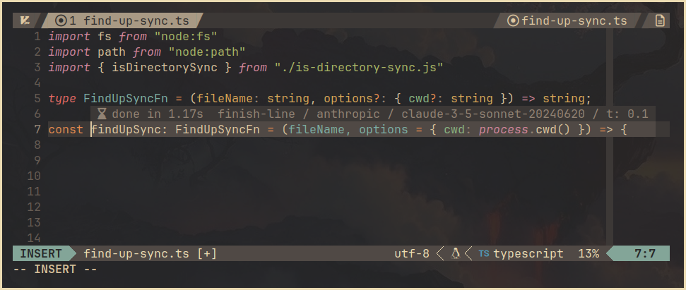
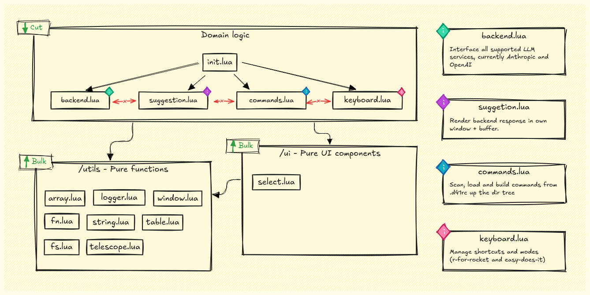

# deckr41/nvim

> Functional programming with *AI agents instead of functions* and *folders
> instead of parameters*.  
> **:brain: Pure Agents** encapsulate domain-specific knowledge and
> capabilities, while **:musical_score: Higher-Order Agents** orchestrate them
> to solve complex problems across your codebase.

`deckr41/nvim` is a Neovim plugin that adds 🤖 LLM capabilities into your
coding workflow. It allows per-project AI customization through 📂 collocated
`.d41rc` files, effectively turning folders into **Pure Agents** - AI agents
with their own identity, mission, and context, similar to pure functions with
clear domains and boundaries.

At a higher level, your projects become **Higher-Order Agents**, orchestrating
and composing Pure Agents to build features across your entire codebase.



## Progress

> [!IMPORTANT]
> Most is work in progress and subject to change. The plugin is functional but
> many advanced capabilities are still in progress.

### Implemented Features

- [x] **Custom Keyboard Modes**: Use `easy-does-it` for on-demand code
  suggestions or `r-for-rocket` for real-time as you type suggestions.
- [x] **Run Commands in NORMAL and VISUAL Modes**: Execute custom context aware
  AI prompts directly from your editor.
- [x] **Dynamic Backend and Model Switching**: Change AI backends and models at
  runtime.
- [x] **Reload Commands on `.d41rc` Changes**: Automatically update commands when
  your configuration changes.
- [x] **Recursive Command Loading**: Scan and load commands from `.d41rc` files
  up the directory tree.

### Work in Progress

- [ ] **Semantic Search:** Generate, store, and keep embeddings synced for
  project files.
- [ ] **Fine-Tuned Models:** UX for training models based on specific project
  files for more accurate suggestions.
- [ ] **Background Commands and LSP Integration:** Run commands in the
  background and expose entry points through LSP.
- [ ] **Tool Support:** Implement custom tools for enhanced AI capabilities.
- [ ] **Enhanced UI:** Support `select` parameters, add `input` prompts, allow
  split buffer instead of floating windows.

## :star2: Features

### :keyboard: Simple one-shot Commands

Define prompts with context, variable interpolation, and model parameter
control.

<details>
<summary>Example: Explaining a piece of code using a command in `.d41rc`</summary>

```json
{
  "$schema": "https://raw.githubusercontent.com/deckr41/nvim/schemas/rc.json",
  "commands": [
    {
      "id": "explain-code",
      "parameters": {
        "depth": {
          "type": "select",
          "label": "How deep should the explanation go?",
          "default": "overview",
          "options": [
            {
              "label": "Overview",
              "value": "overview"
            },
            {
              "label": "In-Depth",
              "value": "in-depth"
            }
          ]
        }
      },
      "system_prompt": [
        "You are an experienced {{FILE_SYNTAX}} programmer and an exceptional teacher. Your mission is to explain the code to the user clearly and concisely, ensuring they understand both what the code does and why it works that way.",
        "You follow the coding standards, emphasizing clarity, brevity, and simplicity. You explain complex concepts in a way that even a beginner can understand, while also providing deeper insights for advanced users.",
        "",
        "## Purpose",
        "You will explain the selected code in {{PARAMETERS.depth}} detail, focusing on making the code easy to understand. Be clear, concise, and highlight how the code adheres to best practices, or suggest improvements if necessary.",
        "Take a deep breath and guide the user through the flow and logic of the code, ensuring they see not just the 'what', but also the 'why' behind it."
      ],
      "context": [
        {
          "prompt": [
            "For reference, the main project README.md:",
            "",
            "```markdown",
            "{{file://README.md}}",
            "```"
          ]
        }
      ],
      "prompt": [
        "## Code to Explain",
        "",
        "{{TEXT}}",
        "",
        "## Explanation Depth",
        "The user has requested a(n) {{PARAMETERS.depth}} explanation.",
        "",
        "## Important",
        "Provide a clear, structured explanation. If the user asks for an overview, focus on the big picture. If they request an in-depth explanation, dive into the details of how the code works, including edge cases or performance considerations."
      ],
      "temperature": 0.3,
      "on_accept": "insert",
      "response_syntax": "markdown"
    }
  ]
}
```
</details>

### :brain: Pure Agents

Encapsulate domain-specific knowledge using 📂 collocated `.d41rc` files,
acting like pure functions with clear boundaries and responsibilities.

<details>
<summary>Example: A Pure Agent `.d41rc` for a React UI button component:</summary>

```json
{
  "$schema": "https://raw.githubusercontent.com/deckr41/nvim/schemas/rc.json",
  "agent": {
    "id": "ui-button",
    "identity": "You are a Pure Agent responsible for the 'UIButton' component in a React application.",
    "domain": [
      "Your domain is strictly within the UIButton component, and you should not make changes outside of it.",
      "You are responsible for and allowed to make changes to the following files:",
      "{{FOLDER_TREE}}"
    ],
    "mission": [
      "Your mission is to implement features or modifications to the UIButton component as requested, while adhering to the component's responsibilities.",
      "You have deep knowledge of React, JavaScript, and UI best practices."
    ]
  },
  "commands": [
    {
      "id": "fulfill-purpose",
      "parameters": {
        "request": {
          "type": "string",
          "description": "User's question or assignment",
          "is_required": true
        },
        "context":{
          "type": "string",
          "description": ""
        }
      },
      "system_prompt": [
        "{{AGENT_IDENTITY}}",
        "{{AGENT_DOMAIN}}",
        "{{AGENT_MISSION}}"
      ],
      "context": [
        {
          "semantic-search": {
            "query": "{{PARAMS.request}}"
          }
        },
        {
          "prompt": [
            "Component description and usage guidelines:",
            "",
            "{{file://README.md}}"
          ]
        }
      ],
      "prompt": [
        "## Request",
        "{{PARAMS.request}}",
        "",
        "## Constraints",
        "- Ensure the UIButton remains reusable and maintains existing functionality.",
        "- Any new props or features added must be relevant to a UI button.",
        "- Do not modify or reference code outside of the UIButton component.",
        "",
        "## Instructions",
        "Provide only the updated code for the UIButton component, incorporating the requested feature."
      ],
      "temperature": 0.2,
      "max_tokens": 500
    }
  ]
}
```
</details>

### :musical_score: Higher-Order Agents

Projects act as orchestrators, composing Pure Agents to solve complex,
cross-cutting problems across your codebase.

<details>
<summary>Example: A Higher-Order Agent `.d41rc` for a React application:</summary>

```json
{
  "$schema": "https://raw.githubusercontent.com/deckr41/nvim/schemas/rc.json",
  "agent": {
    "id": "react-app-hoa",
    "identity": "You are a Higher-Order Agent responsible for orchestrating Pure Agents to implement complex features across the codebase.",
    "domain": [
      "Your domain encompasses the entire project, and you can coordinate with any Pure Agents defined within it.",
      "You have access to the following Pure Agents as Tools:",
      "{{AGENTS_LIST}}"
    ],
    "mission": [
      "Your mission is to plan, coordinate, and implement features that require collaboration among multiple Pure Agents.",
      "You ensure that each Pure Agent works within its domain while contributing to the overall goal."
    ]
  },
  "commands": [
    {
      "id": "fulfill-purpose",
      "parameters": {
        "request": {
          "type": "string",
          "description": "User's question or assignment",
          "is_required": true
        }
      },
      "system_prompt": [
        "{{AGENT.identity}}",
        "{{AGENT.domain}}",
        "{{AGENT.mission}}"
      ],
      "tools": [
        "agent://ui-button",
        "agent://utility-functions"
      ],
      "context": [
        {
          "prompt": [
            "Project-wide guidelines and best practices:",
            "",
            "{{file://docs/ProjectGuidelines.md}}"
          ]
        }
      ],
      "prompt": [
        "## Request",
        "{{USER_REQUEST}}",
        "",
        "## Plan",
        "Develop a step-by-step plan to fulfill the request by coordinating with the appropriate Pure Agents using the available Tools.",
        "",
        "## Execution",
        "Execute the plan by invoking the necessary Tools and collecting their outputs.",
        "",
        "## Constraints",
        "- Ensure each Pure Agent operates strictly within its domain.",
        "- Provide clear instructions when invoking each Tool.",
        "- Do not perform changes directly; delegate tasks to Pure Agents.",
        "",
        "## Instructions",
        "Provide the final implementation plan and any code or instructions resulting from the coordination."
      ],
      "temperature": 0.3,
      "max_tokens": 1000
    }
  ]
}
```
</details>

### :floppy_disk: Commands and Agents as Code

Implement AI commands and agents through code, allowing you to version-control,
share, and collaborate on AI behaviors alongside your codebase.

### :hammer: Tools

Extend AI with custom tools for tasks like computations and API interactions.

<details>
<summary>1. Define tools locally in `./.deckr41/tools.json`, next to `.d41rc`:</summary>

```json
{
  "$schema": "https://raw.githubusercontent.com/deckr41/nvim/schemas/tools.json",
  "tools": [
    {
      "name": "calculator",
      "description": "A simple calculator that performs basic arithmetic operations.",
      "input": {
        "expression": {
          "type": "string",
          "description": "The mathematical expression to evaluate (e.g., '2 + 3 * 4').",
          "isRequired": true
        }
      }
    }
  ]
}
```
</details>


<details>
<summary>2. Reference them in your commands:</summary>

```json
{
  "$schema": "https://raw.githubusercontent.com/deckr41/nvim/schemas/rc.json",
  "commands": [
    {
      "id": "calculate",
      "system_prompt": [
        "You are a mathematical assistant."
      ],
      "tools": [
        "calculator"
      ],
      "prompt": [
        "Calculate the following expression:",
        "",
        "{{TEXT}}"
      ],
      "temperature": 0,
      "max_tokens": 50
    }
  ]
}
```
</details>

### :mag: Semantic Search

Link files or perform project-wide semantic searches to enhance AI context.

:books: **Retrieval-Augmented Generation (RAG) with
[DevDocs](https://github.com/freeCodeCamp/devdocs/tree/main)** *(Work in
Progress)*  

Integrate with [devdocs.io](https://devdocs.io/) for accurate, context-rich AI
responses.

## Table of contents

<!-- vim-markdown-toc GFM -->

* [Installation](#installation)
  * [Minimal Configuration](#minimal-configuration)
  * [Modes](#modes)
  * [Full Configuration Options](#full-configuration-options)
  * [Setting Up API Keys](#setting-up-api-keys)
* [Usage](#usage)
  * [Default Keybindings](#default-keybindings)
  * [Commands](#commands)
* [Understanding `.d41rc`](#understanding-d41rc)
  * [Structure and Commands](#structure-and-commands)
  * [Variable Interpolation](#variable-interpolation)
* [Development](#development)
  * [Code overview](#code-overview)
* [Credits](#credits)

<!-- vim-markdown-toc -->

## Installation

### Minimal Configuration

To get started, you need to set either the `OPENAI_API_KEY` or
`ANTHROPIC_API_KEY` environment variable. If both are set, Anthropic is used by
default.

**Example for `lazy.nvim`**:

```lua
{
  "deckr41/nvim",
  event = { "BufEnter" },
  opts = {
    -- Your configuration here or leave empty for defaults.
    -- See below all options.
  },
  dependencies = {
    "nvim-lua/plenary.nvim"
  },
}
```

### Modes

- **`easy-does-it`** - Suggestions on demand with `<S-Right>`:
  - Press once to trigger the [`finish-line`](.d41rc#L28) command.
  - Press twice quickly to trigger the [`finish-section`](.d41rc#L56) command.
- **`r-for-rocket`** - Real-time suggestions with 1000ms debounce in INSERT
  mode. 

Configure modes in the `modes` key of your setup.

### Full Configuration Options

Below is the default configuration with all available settings:

```lua
opts = {
  --
  -- Mode configuration
  --
  modes = {
    ["easy-does-it"] = {
      -- Command triggered by pressing `<S-Right>` once.
      command = "finish-line",

      -- Command triggered by pressing `2x<S-Right>` quickly.
      double_command = "finish-section",
    },
    ["r-for-rocket"] = {
      -- Command triggered when entering or writing in INSERT mode.
      command = "finish-section",

      -- Debounce timeout in milliseconds, relevant for `r-for-rocket` mode.
      timeout = 1000,
    },
  },
  active_mode = "easy-does-it",

  --
  -- Backend configurations
  --
  backends = {
    openai = {
      url = "https://api.openai.com/v1/chat/completions",
      api_key = os.getenv("OPENAI_API_KEY"),
      default_model = "gpt-4o-mini",
      available_models = {
        ["gpt-4o"] = { max_tokens = 4096 },
        ["gpt-4o-2024-08-06"] = { max_tokens = 16384 },
        ["gpt-4o-mini"] = { max_tokens = 16384 },
      },
      temperature = 0.2,
    },
    anthropic = {
      url = "https://api.anthropic.com/v1/messages",
      api_key = os.getenv("ANTHROPIC_API_KEY"),
      default_model = "claude-3-5-sonnet-20240620",
      available_models = {
        ["claude-3-5-sonnet-20240620"] = { max_tokens = 1024 },
      },
      temperature = 0.2,
    },
  },

  -- If not specified, the auto-detect backend is used.
  -- If both are active, Anthropic is used.
  active_backend = nil,

  -- If not specified, the backend's `default_model` is used.
  active_model = nil, 
}
```

### Setting Up API Keys

Add keys to your shell profile file (`.bashrc`, `.zshrc`, etc.):

```sh
export OPENAI_API_KEY="your-openai-api-key"
export ANTHROPIC_API_KEY="your-anthropic-api-key"
```

## Usage

### Default Keybindings

**INSERT** mode:

- `<S-Right>`: Trigger suggestions.
  - Press `<S-Right>` once to trigger the `finish-line` command.
  - Press `<S-Right>` twice quickly to trigger the `finish-section` command.
- `<Tab>` or `<S-Right>`: Accept suggestion.
- `<Escape>` or `CursorMoved`: Dismiss suggestion.

**NORMAL** and **VISUAL** mode:

- `<leader>dc`: Open the command palette to run AI commands.
- `<leader>dp`: Open the control panel to switch backends and modes.

### Commands

- `:D41EjectDefaultCommands`: Ejects the default `.d41rc` file into your
  current working directory for customization.
- `:D41ControlPanel`: Opens the control panel to switch backends, models, and
  modes.
- `:D41RunCommand`: Opens the command palette to execute a command from your
  `.d41rc` configurations.

## Understanding `.d41rc`

`.d41rc` files configure AI behavior and commands per project. Multiple files
can coexist, allowing flexible customization.

- **Special Nodes**: There are two special `.d41rc` files:
  - **Plugin's Default Commands**: Provided by the plugin, located at
    `plugin_path/.d41rc`. This is the file ejected by
    `:D41EjectDefaultCommands` command.
  - **User-Specific Commands**: Located at `~/.config/deckr41/.d41rc`, allowing
    you to add your own commands.
- **Command Loading:** Commands from all `.d41rc` files are loaded and
  accessible from the command palette via `:D41RunCommand` or `<leader>dc`.
  Commands are not overwritten; they coexist, and you can choose which command
  to execute from their respective file.

### Structure and Commands

Each `.d41rc` is a JSON object containing commands:

```json
{
  "$schema": ".d41rc-schema.json",
  "commands": [
    {
      "id": "zen-one-shot",
      "system_prompt": [
        "You are a Zen master named Zero, the master of one-liners.",
        "You will respond similar to how a Zen master would, in koans, short and succinct riddles, analogies or metaphors.",
        "Now. Take a deep breath. Each word written unfolds the answer."
      ],
      "prompt": [
        "{{TEXT}}"
      ],
      "temperature": 0.7,
      "max_tokens": 100
    }
  ]
}
```

Refer to the schema definition [here](schemas/rc.json).

### Variable Interpolation

The `system_prompt` and `prompt` fields support dynamic variable interpolation,
allowing you to include contextual information in your prompts:

- **{{FILE_PATH}}:** Current file path.
- **{{FILE_SYNTAX}}:** Current file's language.
- **{{LINES_BEFORE_CURRENT}}:** Lines before the current line.
- **{{LINES_AFTER_CURRENT}}:** Lines after the current line.
- **{{TEXT_BEFORE_CURSOR}}:** Text before the cursor on the current line.
- **{{TEXT_AFTER_CURSOR}}:** Text after the cursor on the current line.
- **{{TEXT}}:** Selected text (if any), or the entire buffer if no selection.

## Development

### Code overview

The plugin's architecture is modular, with each component responsible for a
clear, isolated piece of domain.



## Credits

- Inspired by [llm.nvim](https://github.com/melbaldove/llm.nvim) and
  [ell](https://github.com/MadcowD/ell).

