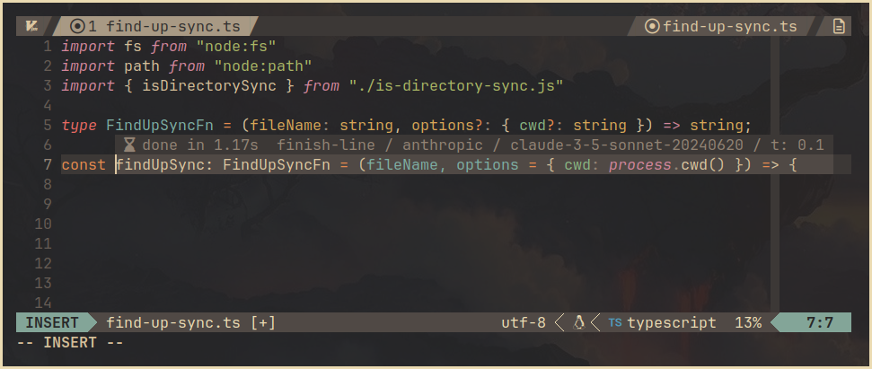
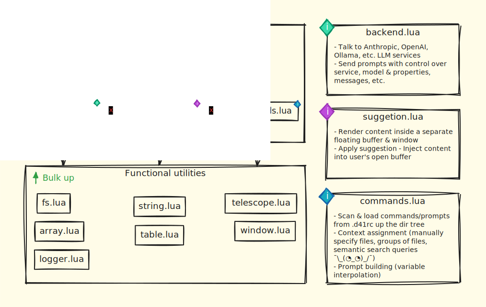

# deckr41/nvim

> A NeoVim plugin to augument coding with LLM abilities, focusing on mindful
> collaboration and prompt engineering—laying the foundation for multi-agent AI
> workflows within your projects.



## Table of contents

<!-- vim-markdown-toc GFM -->

* [Thoughts](#thoughts)
* [Installation](#installation)
    * [Minimal Configuration](#minimal-configuration)
    * [Full Configuration Options](#full-configuration-options)
    * [Setting Up API Keys](#setting-up-api-keys)
* [Usage](#usage)
    * [Default Keybindings](#default-keybindings)
    * [Commands](#commands)
* [Development](#development)
    * [Code overview](#code-overview)
* [Credits](#credits)
* [Related Plugins](#related-plugins)

<!-- vim-markdown-toc -->

## Thoughts

:godmode: **Unblockr Mode**  
Use LLM suggestions when stuck, saving yourself a web search without breaking
flow. Avoid relying on it for all the things all the time; give yourself a few
seconds, minutes, even hours :scream:. *Tab-coding* can be detrimental without
patience and understanding - risking a *doom-scrolling* effect.

:construction: **Prompt Engineering**  
Create and iterate over `commands`, a combination of `system_prompt`, `prompt`,
and `context`. Commands can be project-wide or specific to a library in your
monorepo through localized `.d41rc` files. This approach allows per-project AI
customization, effectively turning folders into agents—laying the groundwork
for multi-agent AI workflows.

:hammer: **Tools** *(Work in Progress)*  
Enhance `commands` with extra features by incorporating custom `tools`. For
example, you can define tools that perform specific tasks like scientific
computations, interact with custom APIs, or generate graphs. This enables more
complex and powerful interactions, giving more accurate and context-aware
suggestions.

:mag: **Semantic Search** *(Work in Progress)*  
Enhance the relevance of AI suggestions by providing richer context. Commands
can pull in data on demand depending on the use case:
- **Link to Specific Files**: Include content from specific files relative to
  the .d41rc file.  
  `"context": ["file://coding-standards.md"]`
- **Perform Semantic Searches**: Search within sibling folders and attach the
  top 3 files as context.  
  `"context": ["semq:3://best practice examples of Jest tests"`

:books: **Retrieval-Augmented Generation (RAG) with
[DevDocs](https://github.com/freeCodeCamp/devdocs/tree/main)** *(Work in
Progress)*  
Integrate [devdocs.io](https://devdocs.io/), which combines multiple API
documentations into a fast, organized, and searchable interface. By
incorporating DevDocs, you can perform semantic searches over documentation and
inject relevant snippets directly into your AI prompts. This reduces
hallucinations and ensures the AI provides up-to-date and accurate information.

Example:

- **TechDocsTool**: A `tool` that accepts parameters like technology name,
  version, and query to perform semantic searches in documentation and return
  relevant information.

:art: **UI/UX/DX**  
Aiming for minimalism. Fewer shortcuts and configurations are better. Mnemonics
are helpful, and *just-in-time* is preferred over *all-the-time*. Buffers are
the canvas, and while creating a conversational UI inside the editor is
possible, it might miss the essence of seamless integration.

## Installation

### Minimal Configuration

To get started with `deckr41/nvim`, you need to have either the `OPENAI_API_KEY`
or `ANTHROPIC_API_KEY` environment variables set. If both are available, the
plugin will default to using Anthropic.

**Default Backends**:

- **OpenAI**: Uses `gpt-4o-mini` as the default model.
- **Anthropic**: Uses `claude-3-5-sonnet-20240620` as the default model.

**Example using `lazy.nvim`**:

```lua
{
  "deckr41/nvim",
  dependencies = {
    "nvim-lua/plenary.nvim",
    "nvim-telescope/telescope.nvim",
  },
}
```

### Full Configuration Options

You can customize the plugin by providing additional options. Below is the
default configuration with all available settings:

```lua
{
  "deckr41/nvim",
  opts = {
    backends = {
      openai = {
        url = "https://api.openai.com/v1/chat/completions",
        api_key = os.getenv("OPENAI_API_KEY"),
        default_model = "gpt-4o-mini",
        available_models = {
          ["gpt-4o"] = { max_tokens = 4096 },
          ["gpt-4o-2024-08-06"] = { max_tokens = 16384 },
          ["gpt-4o-mini"] = { max_tokens = 16384 },
        },
        temperature = 0.2,
      },
      anthropic = {
        url = "https://api.anthropic.com/v1/messages",
        api_key = os.getenv("ANTHROPIC_API_KEY"),
        default_model = "claude-3-5-sonnet-20240620",
        available_models = {
          ["claude-3-5-sonnet-20240620"] = { max_tokens = 1024 },
        },
        temperature = 0.2,
      },
    },

    -- If not specified, the auto-detect backed is used. 
    -- If both are active, Anthropic is used.
    active_backend = nil,

    -- If not specified, the backend's `default_model` is used.
    active_model = nil, 

    -- Command triggered by pressing `<S-Right>` once.
    default_command = "finish-line",

    -- Command triggered by pressing `<S-Right>` twice quickly.
    default_double_command = "finish-block",
  },
  dependencies = {
    "nvim-lua/plenary.nvim",
    "nvim-telescope/telescope.nvim",
  },
}
```

### Setting Up API Keys

Ensure you have set the necessary environment variables:

- For **OpenAI**: `OPENAI_API_KEY`
- For **Anthropic**: `ANTHROPIC_API_KEY`

Add them to your shell's profile file (`.bashrc`, `.zshrc`, etc.):

```bash
export OPENAI_API_KEY="your-openai-api-key"
export ANTHROPIC_API_KEY="your-anthropic-api-key"
```

> [!NOTE] 
> Integration with password managers is somewhere in the backlog. 

## Usage

### Default Keybindings

**INSERT** mode:

- **`<Shift-RightArrow>`**: Trigger the default command (`finish-line`) or
  accept the current suggestion.
  - Pressing `<S-Right>` once will trigger the `finish-line` command.
  - Pressing `<S-Right>` twice quickly will trigger the `finish-block` command.
- **`<Tab>`**, **`<CR>`** or **`<S-Right>`** with a suggestion available:
  Accept the suggestion and insert it into the buffer.
- **`<Escape>`**: Dismiss the current suggestion without inserting.

> [!NOTE]
> Currently, only **INSERT** mode is supported. Running commands in **VISUAL**
> and **NORMAL** mode will be implemented soon.

### Commands

- **`:D41Eject`**: Ejects the default `.d41rc` file into your current working
  directory for customization.

## Development

### Code overview

The plugin's architecture is modular, with each component responsible for a
specific functionality:



## Credits

- [llm.nvim](https://github.com/melbaldove/llm.nvim) - Provided inspiration for
  simple and effective implementation.
- [ell](https://github.com/MadcowD/ell) - Highlighted the importance of
  treating prompts as algorithms that require iteration and debugging (intro by
  [Ian Wootten](https://www.youtube.com/watch?v=IQI5BZlVI3Y)).

## Related Plugins

- [ChatGPT.nvim](https://github.com/jackMort/ChatGPT.nvim) - Effortless Natural
  Language Generation with OpenAI's ChatGPT API 
- [avante.nvim](https://github.com/yetone/avante.nvim) - Use your Neovim like
  using Cursor AI IDE! 
- [codecompanion.nvim](https://github.com/olimorris/codecompanion.nvim) -
  AI-powered coding, seamlessly in Neovim. Supports Anthropic, Copilot, Gemini,
  Ollama and OpenAI LLMs 
