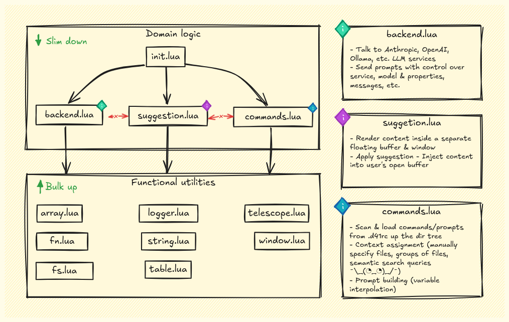

# deckr41/nvim

> Functional programming with *AI agents instead of functions* and *folders
> instead of parameters*.  
> **:brain: Pure Agents** encapsulate domain-specific knowledge and
> capabilities, while **:musical_score: Higher-Order Agents** orchestrate them
> to solve complex problems across your codebase.

`deckr41/nvim` is a Neovim plugin that adds 🤖 LLM capabilities directly into
your workflow, allowing per-project AI customization through 📂 collocated
`.d41rc` files, turning folders into **Pure Agents**—AI agents with their own
identity, mission and context, akin to pure functions with clear domains and
boundaries.

At a higher level, your projects become **Higher-Order Agents**, orchestrating
and composing Pure Agents to build features across your entire codebase.


## Progress

> [!IMPORTANT]
> Most is work in progress and subject to change. The repo serves as my own
> scratchpad while I iterate and reason about what I actually want.  
> The plugin is functional but many advanced capabilities are still in
> progress.

- [ ] Implement tool support
- [ ] **Run commands** in **NORMAL** and **VISUAL** modes
- [x] **Reload** `.d41rc` files **on-change**
- [x] Get **auto-completion** suggestions in **INSERT** mode
- [x] **Switch at run-time** backend, model and keyboard modes
- [x] Implement `easy-does-it` and `r-for-rocket` **keyboard modes**
- [x] **Scan and load commands** from `.d41rc` files up the tree

## :star2: Features

### :keyboard: Simple one-shot Commands

Define prompts with context, variable interpolation, model parameter control

<details>
<summary>Example of a Command `.d41rc` file, explaining a piece of code:</summary>

```json
{
  "$schema": "https://raw.githubusercontent.com/deckr41/nvim/schemas/rc.json",
  "commands": [
    {
      "id": "explain-code",
      "system_prompt": "You are the best explainer of {{FILE_SYNTAX}} code there is, the greatest meaning and intention unraveller. You are a mind reader and have deep insight into what the user wanted to achieve.",
      "context": [
        {
          "prompt": [
            "For reference, the main project README.md:",
            "",
            "```markdown",
            "{{file://README.md}}",
            "```"
          ]
        }
      ],
      "prompt": [
        "Explain the following code focusing on its purpose, structure, and any notable patterns or techniques used:",
        "",
        "{{FILE_PATH}}",
        "```{{FILE_SYNTAX}}",
        "{{FULL_TEXT}}",
        "```"
      ],
      "temperature": 0.2,
      "max_tokens": 500
    }
  ]
}
```
</details>

### :brain: Pure Agents

Encapsulate domain-specific knowledge using 📂 collocated `.d41rc` files,
acting like pure functions with clear domains and no side effects.

<details>
<summary>Example of a Pure Agent `.d41rc` file, responsible for a React UI button component:</summary>

```json
{
  "$schema": "https://raw.githubusercontent.com/deckr41/nvim/schemas/rc.json",
  "agent": {
    "id": "ui-button",
    "identity": "You are a Pure Agent responsible for the 'UIButton' component in a React application.",
    "domain": [
      "Your domain is strictly within the UIButton component, and you should not make changes outside of it.",
      "You are responsible for and allowed to make changes to the following files:",
      "{{FOLDER_TREE}}"
    ],
    "mission": [
      "Your mission is to implement features or modifications to the UIButton component as requested, while adhering to the component's responsibilities.",
      "You have deep knowledge of React, JavaScript, and UI best practices."
    ]
  },
  "commands": [
    {
      "id": "fulfill-purpose",
      "parameters": {
        "request": {
          "type": "string",
          "description": "User's question or assignment",
          "is_required": true
        },
        "context":{
          "type": "string",
          "description": ""
        }
      },
      "system_prompt": [
        "{{AGENT_IDENTITY}}",
        "{{AGENT_DOMAIN}}",
        "{{AGENT_MISSION}}"
      ],
      "context": [
        {
          "semantic-search": {
            "query": "{{PARAMS.request}}"
          }
        },
        {
          "prompt": [
            "Component description and usage guidelines:",
            "",
            "{{file://README.md}}"
          ]
        }
      ],
      "prompt": [
        "## Request",
        "{{PARAMS.request}}",
        "",
        "## Constraints",
        "- Ensure the UIButton remains reusable and maintains existing functionality.",
        "- Any new props or features added must be relevant to a UI button.",
        "- Do not modify or reference code outside of the UIButton component.",
        "",
        "## Instructions",
        "Provide only the updated code for the UIButton component, incorporating the requested feature."
      ],
      "temperature": 0.2,
      "max_tokens": 500
    }
  ]
}
```
</details>

### :musical_score: Higher-Order Agents

Projects act as orchestrators, composing Pure Agents to solve complex, cross-cutting problems across your codebase.

<details>
<summary>Example of a Higher-Order Agent `.d41rc` file, responsible for a React application:</summary>

```json
{
  "$schema": "https://raw.githubusercontent.com/deckr41/nvim/schemas/rc.json",
  "agent": {
    "id": "react-app-hoa",
    "identity": "You are a Higher-Order Agent responsible for orchestrating Pure Agents to implement complex features across the codebase.",
    "domain": [
      "Your domain encompasses the entire project, and you can coordinate with any Pure Agents defined within it.",
      "You have access to the following Pure Agents as Tools:",
      "{{AGENTS_LIST}}"
    ],
    "mission": [
      "Your mission is to plan, coordinate, and implement features that require collaboration among multiple Pure Agents.",
      "You ensure that each Pure Agent works within its domain while contributing to the overall goal."
    ]
  },
  "commands": [
    {
      "id": "fulfill-purpose",
      "parameters": {
        "request": {
          "type": "string",
          "description": "User's question or assignment",
          "is_required": true
        }
      },
      "system_prompt": [
        "{{AGENT.identity}}",
        "{{AGENT.domain}}",
        "{{AGENT.mission}}"
      ],
      "tools": [
        "agent://ui-button",
        "agent://utility-functions"
      ],
      "context": [
        {
          "prompt": [
            "Project-wide guidelines and best practices:",
            "",
            "{{file://docs/ProjectGuidelines.md}}"
          ]
        }
      ],
      "prompt": [
        "## Request",
        "{{USER_REQUEST}}",
        "",
        "## Plan",
        "Develop a step-by-step plan to fulfill the request by coordinating with the appropriate Pure Agents using the available Tools.",
        "",
        "## Execution",
        "Execute the plan by invoking the necessary Tools and collecting their outputs.",
        "",
        "## Constraints",
        "- Ensure each Pure Agent operates strictly within its domain.",
        "- Provide clear instructions when invoking each Tool.",
        "- Do not perform changes directly; delegate tasks to Pure Agents.",
        "",
        "## Instructions",
        "Provide the final implementation plan and any code or instructions resulting from the coordination."
      ],
      "temperature": 0.3,
      "max_tokens": 1000
    }
  ]
}
```
</details>

### :floppy_disk: Commands and Agents as Code

Implement AI commands and agents through code, allowing
you to version-control, share, and collaborate on AI
behaviors alongside your codebase.

### :hammer: Tools

Extend AI with custom tools for tasks like computations and API interactions.

<details>
<summary>1. Define tools locally in `./.deckr41/tools.json`, next to `.d41rc`:</summary>

```json
{
  "$schema": "https://raw.githubusercontent.com/deckr41/nvim/schemas/tools.json",
  "tools": [
    {
      "name": "calculator",
      "description": "A simple calculator that performs basic arithmetic operations.",
      "input": {
        "expression": {
          "type": "string",
          "description": "The mathematical expression to evaluate (e.g., '2 + 3 * 4').",
          "isRequired": true
        }
      }
    }
  ]
}
```
</details>


<details>
<summary>2. Reference them in your commands:</summary>

```json
{
  "$schema": "https://raw.githubusercontent.com/deckr41/nvim/schemas/rc.json",
  "commands": [
    {
      "id": "calculate",
      "system_prompt": [
        "You are a mathematical assistant."
      ],
      "tools": [
        "calculator"
      ],
      "prompt": [
        "Calculate the following expression:",
        "",
        "{{FULL_TEXT}}"
      ],
      "temperature": 0,
      "max_tokens": 50
    }
  ]
}
```
</details>

### :mag: Semantic Search

Link files or perform project-wide semantic searches to enhance AI context.

:books: **Retrieval-Augmented Generation (RAG) with
[DevDocs](https://github.com/freeCodeCamp/devdocs/tree/main)** *(Work in
Progress)*  

Integrate with [devdocs.io](https://devdocs.io/) for accurate, context-rich AI
responses.

## Table of contents

<!-- vim-markdown-toc GFM -->

* [Installation](#installation)
  * [Minimal Configuration](#minimal-configuration)
  * [Modes](#modes)
  * [Full Configuration Options](#full-configuration-options)
  * [Setting Up API Keys](#setting-up-api-keys)
* [Usage](#usage)
  * [Default Keybindings](#default-keybindings)
  * [Commands](#commands)
* [Understanding `.d41rc`](#understanding-d41rc)
  * [Structure and Commands](#structure-and-commands)
  * [Variable Interpolation](#variable-interpolation)
* [Development](#development)
  * [Code overview](#code-overview)
* [Credits](#credits)

<!-- vim-markdown-toc -->

## Installation

### Minimal Configuration

To get started, you just need `OPENAI_API_KEY` or `ANTHROPIC_API_KEY`
environment variables set. If both are set, Anthropic is used.

**Example for `lazy.nvim`**:

```lua
{
  "deckr41/nvim",
  event = { "BufEnter" },
  opts = {
    -- Your configuration here or leave empty for defaults.
    -- See below all options.
  },
  dependencies = {
    "nvim-lua/plenary.nvim",
    "nvim-telescope/telescope.nvim",
  },
}
```

### Modes

- **`easy-does-it`** - Suggestions on demand with `<S-Right>`:
    - Pressing once will run the [`finish-line`](.d41rc#L5) command
    - Twice will run [`finish-block`](.d41rc#L38)
- **`r-for-rocket`** - Real-time suggestions with 1000ms debounce in INSERT
  mode. 

See `modes` key in configuration for setup.

### Full Configuration Options

Below is the default configuration with all available settings:

```lua
opts = {
  --
  -- Mode configuration
  --
  modes = {
    ["easy-does-it"] = {
      -- Command triggered by pressing `<S-Right>` once.
      command = "finish-line",

      -- Command triggered by pressing `2x<S-Right>` quickly.
      double_command = "finish-block",
    },
    ["r-for-rocket"] = {
      -- Command triggered when entering or writing in INSERT mode
      command = "finish_block",

      -- Debounce timeout in milliseconds, relevant for `r-for-rocket` mode
      timeout = 1000,
    },
  },
  active_mode = "easy-does-it",

  --
  -- Backend configurations
  --
  backends = {
    openai = {
      url = "https://api.openai.com/v1/chat/completions",
      api_key = os.getenv("OPENAI_API_KEY"),
      default_model = "gpt-4o-mini",
      available_models = {
        ["gpt-4o"] = { max_tokens = 4096 },
        ["gpt-4o-2024-08-06"] = { max_tokens = 16384 },
        ["gpt-4o-mini"] = { max_tokens = 16384 },
      },
      temperature = 0.2,
    },
    anthropic = {
      url = "https://api.anthropic.com/v1/messages",
      api_key = os.getenv("ANTHROPIC_API_KEY"),
      default_model = "claude-3-5-sonnet-20240620",
      available_models = {
        ["claude-3-5-sonnet-20240620"] = { max_tokens = 1024 },
      },
      temperature = 0.2,
    },
  },

  -- If not specified, the auto-detect backed is used. 
  -- If both are active, Anthropic is used.
  active_backend = nil,

  -- If not specified, the backend's `default_model` is used.
  active_model = nil, 
}
```

### Setting Up API Keys

Add keys to your shell profile file (`.bashrc`, `.zshrc`, etc.):

```sh
export OPENAI_API_KEY="your-openai-api-key"
export ANTHROPIC_API_KEY="your-anthropic-api-key"
```

## Usage

### Default Keybindings

**INSERT** mode:

- `<S-Right>`: Trigger suggestions.
  - Press `<S-Right>` once will trigger the `finish-line` command.
  - Press `<S-Right>` twice quickly will trigger the `finish-block` command.
- `<Tab>`, `<S-Right>`: Accept suggestion.
- `<Escape>`: Dismiss suggestion.

**VISUAL** mode: *(Work in Progress)*

**NORMAL** mode: *(Work in Progress)*

### Commands

- **`:D41Eject`**: Ejects the default `.d41rc` file into your current working
  directory for customization.

## Understanding `.d41rc`

`.d41rc` files configure AI behavior and commands per project. Multiple files
can coexist, allowing flexible customization.

- Commands are loaded from `.d41rc` files up the directory tree, stopping at
  the first file with `"root": true`. *(Work in Progress)*
- Commands merge top-down, so closer `.d41rc` files can override those above,
  with deep merging for selective changes, for example allowing the addition of
  certain context files to an existing command. *(Work in Progress)*

### Structure and Commands

Each `.d41rc` is a JSON object containing commands:

```json
{
  "$schema": ".d41rc-schema.json",
  "commands": [
    {
      "id": "zen-one-shot",
      "system_prompt": [
        "You are a Zen master named Zero, the master of one-liners.",
        "You will respond similar to how a Zen master would, in koans, short and succinct riddles, analogies or metaphors.",
        "Now. Take a deep breath. Each word written unfolds the answer."
      ],
      "prompt": [
        "{{FULL_TEXT}}"
      ],
      "temperature": 0.7,
      "max_tokens": 100
    }
  ]
}
```

Refer to the schema definition [here](.d41rc-schema.json).

### Variable Interpolation

The `system_prompt` and `prompt` fields support dynamic variable interpolation:

- **`{{FILE_PATH}}`**: Current file path.
- **`{{FILE_SYNTAX}}`**: Current file's language.
- **`{{FILE_CONTENT}}`**: Entire document.
- **`{{LINES_BEFORE_CURRENT}}`**: Code before the line.
- **`{{TEXT_BEFORE_CURSOR}}`**: Text before cursor.
- **`{{LINES_AFTER_CURRENT}}`**: Code after the line.

## Development

### Code overview

The plugin's architecture is modular, with each component responsible for a
clear, isolated piece of domain.



## Credits

- Inspired by [llm.nvim](https://github.com/melbaldove/llm.nvim) and
  [ell](https://github.com/MadcowD/ell).

